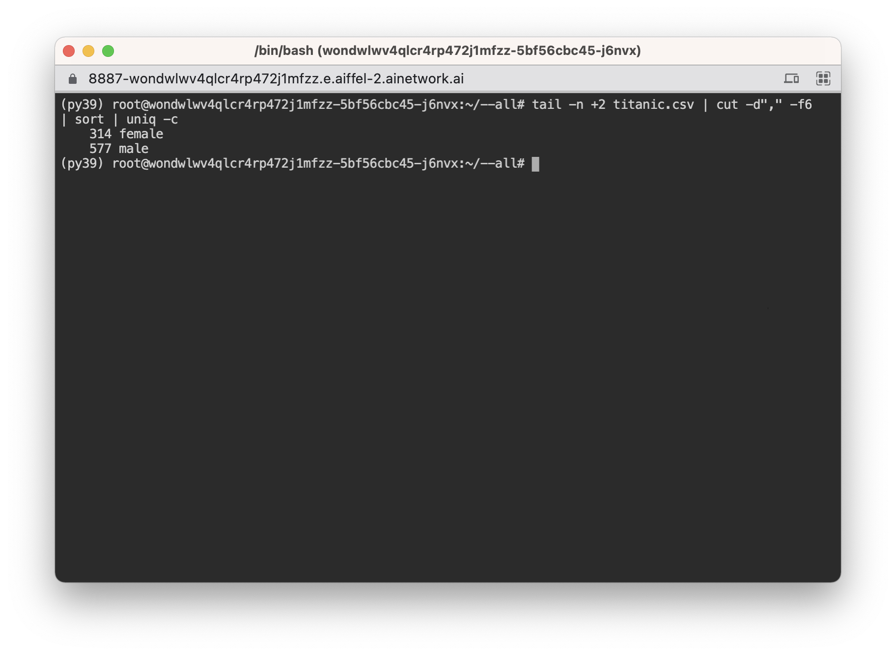

# FUNDAMENTAL 03

## 터미널

```bash
root@wtetysocxvx7e6avqwhctccah-776475db6-h2swf:~#
```

- @ cloud shell에서는 $이 아닌 root@wtetysocxvx7e6avqwhctccah-776475db6-h2swf:~# 형태로 표시가 됩니다.
- @ 앞의 `root`은 현재 로그인한 사용자명입니다.
- @ 뒤의 wtetysocxvx7e6avqwhctccah-776475db6-h2swf는 컴퓨터의 이름, 호스트명입니다.
- : 뒤의 `~`는 현재 위치입니다.
- 마지막 `#`는 현재 로그인한 사용자가 최고 관리자 계정(root)임을 나타내고 일반 사용자임의 경우에는 `$`로 표시됩니다.

### ls

---

- `-l`: 각 파일 및 폴더의 권한, 소유자, 크기, 수정일시 등 자세한 정보를 출력합니다.
- `-h`: 파일 크기를 바이트 수 대신 사람이 알아볼 수 있는 단위(1K, 234M, 2G 등)로 표시합니다.
- `-t`: 파일 수정시간 순으로 정렬해서 출력합니다. 최신 파일이 위쪽으로 표시됩니다.
- `-r`: 정렬 순서를 뒤집어 출력합니다. -rt의 형태로 쓰면 최신 파일이 아래쪽으로 표시되어 유용할 때가 있습니다.

### cd
- `/home`: 사용자별 홈 디렉토리들이 있는 곳
- `/root`: 최고 관리자 계정의 홈 디렉토리
- `/mnt`: 저장장치(HDD, SSD)가 붙는 위치
- `/media`: 이동식 미디어(USB 드라이브)가 붙는 위치
- `/tmp`: 재부팅 시 삭제될 임시 파일들을 저장하는 폴더
- `/dev`: 컴퓨터에 연결된 하드웨어 및 가상 기기(device)들을 가리키는 파일들
- `/proc`: 현재 실행 중인 프로세스들을 가리키는 파일들
- `/etc`: 각종 설정 파일들
- `/bin`: 실행 가능한 프로그램(binary)들
- `/sbin`: 시스템 관리용 프로그램들
- `/usr`: 다중 사용자 모드에서 사용 가능한 파일 및 프로그램들 (root 계정만 있는 단일 사용자 모드에서는 사용 불가)
- `/var`: 캐시, 로그 등 시스템 구동 간 계속 내용이 바뀌는 파일들

## 운영체제
운영체제란 컴퓨터의 다양한 하드웨어 장치들과 더불어 소프트웨어를 관리하는 시스템을 일컫는다.

### 프로세스와 스레드
- 프로그램
- 프로세스(process)
- 메모리 관리
- CPU 자원 관리
- 프로세스
- 스레드
- 멀티프로세싱(Multiprocesing)
- 멀티스레딩(Multithreading)

## 리눅스 기반 운영체제

### 프로세스 관리와 시스템 콜
프로세스 확인
- `ps`: 현재 터미널과 관련된 프로세스 목록을 출력
- `ps -ef`: 모든 터미널에서 현재 실행중인 프로세스 목록 및 부가정보를 출력

출력된 내용
- `PID`: process ID
- `TTY`: 해당 프로세스가 붙어있는 teletype(터미널)

프로세스 죽이기
```
sudo kill -s KILL [PPID]
```
- `kill`: PID에 해당하는 프로세스에 시그널을 보낸다

`kill`은 그 자체로 프로세스를 죽이는 명령이 아니라, 프로세스에 신호(Signal)를 보내는 명령어이다.
`kill` 명령어를 입력하는 순간, 셸의 프로세스는 커널에게 이 명령을 전달한다. 커널은 권한 등을 확인한 후에 이를 수행한다. 
이렇게 *프로세스가 커널에게 요청을 전달하는 기능*을 **시스템 콜(system call)**이라 한다.


즉, 시스템 콜은 운영체제의 커널이 프로그램에 제공하는 인터페이스이며, 프로세스가 직접 할 수 없는 프로세스 제어, 파일 조작, 파일 읽기, 장치 및 자원 관리, 네트워크 통신 등을 가능하게 한다.
각 프로세스는 커널을 통하지 않고서는 파일이나 장치 또는 다른 프로세스에 간섭을 할 수 없다.

### 프로그램과 환경변수
- `which`: 명령어의 전체 경로를 출력
- `export`: 셸 변수나 함수를 현재 환경으로 내보낸다.
- `env`: 명령어가 제공되면 해당 명령어를 새로운 환경에서 실행한다. 명령어가 제공되지 않으면 현재 환경의 정보를 출력한다.


### 패키지 설치
```
sudo apt-get install htop
```

### 사용자와 권한
- sudo
- 사용자 그룹
	- `cat /etc/group`
- 접근 권한
	- `chown` : 대상 파일의 소유 사용자와 그룹을 변경한다.
	- `chmod` : 대상 파일의 권한을 변경한다.


## 약간의 하드웨어
- 연산장치
- 저장장치
- 클라우드와 가상화

## 셸 심화

### 셸 스크립트


#### 참고 자료
- ['리눅스/Linux 일반' 카테고리의 글 목록](https://webdir.tistory.com/category/%EB%A6%AC%EB%88%85%EC%8A%A4/Linux%20%EC%9D%BC%EB%B0%98)

### 명령어 모음

필수(❤️) 및 권장(👍) 명령어들은 한번씩 실행하거나, 사용법을 검색해 보는 것을 추천합니다.

- 셸 환경
    - 👍**`history`**: 셸 명령어 이력을 출력합니다.
    - 👍**`man`**: 프로그램의 매뉴얼 페이지를 출력합니다.
    - 👌**`which`**: 명령어의 전체 경로를 출력합니다.
    - 👌**`export`**: 셸 변수나 함수를 현재 환경으로 내보냅니다.
    - 👌**`env`**: 명령어가 제공된다면 해당 명령어를 새로운 환경에서 >실행합니다. 명령어가 제공되지 않은 경우 현재 환경의 정보를 출력합니다.
- 텍스트 처리
    - ❤️**`echo`**: 뒤이어 입력한 내용을 출력합니다.
    - ❤️**`cat`**: 하나 이상의 텍스트 파일을 순서대로 출력합니다.
    - 👍**`sort`**: 입력된 텍스트를 줄 단위로 정렬합니다.
    - 👍**`less`**: 텍스트 파일의 내용을 자유롭게 조회하고 검색합니다.
    - 👍**`head`**: 텍스트 파일의 앞 몇 줄만 출력합니다.
    - 👍**`tail`**: 텍스트 파일의 마지막 몇 줄만 출력합니다.
    - 👍**`cut`**: 텍스트를 구분자(delimiter)에 따라 나눕니다.
    - 👍**`uniq`**: 텍스트 중 중복 값들을 제거합니다.
    - 👍**`grep`**: 정규식을 활용해 텍스트를 검색합니다.
    - 👍**`wc`**: 텍스트를 단어, 줄, 문자 등 단위로 셉니다.
    - 👌**`comm`**: 텍스트 파일을 비교합니다.
    - 👌**`zcat`**: 압축된 텍스트 파일을 출력합니다.
    - 👌**`sed`**: 정규식을 활용해 텍스트를 변형합니다.
    - 👌**`awk`**: 텍스트를 스캔하고 변형합니다.
- 파일 제어 및 이동
    - ❤️**`ls`**: 현재 디렉토리 내의 파일 및 폴더들을 출력합니다.
    - ❤️**`cd`**: Change Directory의 약자로, 뒤에 따라오는 폴더로 >내가 있는 셸의 현재 위치를 이동시킵니다.
    - ❤️**`cp`**: 파일을 복사합니다.
    - ❤️**`mv`**: 파일을 이동합니다.
    - ❤️**`rm`**: 파일을 삭제합니다. 폴더를 삭제하기 위해서는 **`-r`** (recursive) 옵션을, 빈 폴더가 아니더라도 내부까지 삭제하려면 **`-f`** (force) 옵션을 함께 사용해야 합니다.
- 👍**`chown`**: 대상 파일의 소유 사용자와 그룹을 변경합니다.
    - 👍**`chmod`**: 대상 파일의 권한을 변경합니다.
    - 👍**`find`**: 파일을 찾습니다.
    - 👍**`pwd`**: Present Working Directory의 약자입니다. 현재 내가 >위치한 디렉토리 위치를 출력합니다.
    - 👌**`ln`**: 파일에 대한 링크를 생성합니다.
    - 👌**`touch`**: 파일 접근 및 수정 시간을 변경합니다. 빈 파일을 만드는데도 사용할 수 있습니다.
    - 👌**`tar`**: 파일 및 폴더를 하나의 아카이브 파일로 통합하고 압축합니다.
    - 👌**`mount`**: 새로운 저장장치를 파일시스템으로서 추가합니다.
    - 👌**`rename`**: 여러 파일들의 이름을 규칙에 따라 한번에 변경합니다.
    - 👌**`df`**: 파일시스템의 남은 용량을 표시합니다.
- 시스템 및 프로세스 제어
    - ❤️**`sudo`**: 이어지는 명령을 최고 관리자 권한으로 실행합니다.
    - ❤️**`apt-get`**: APT 패키지 관리자를 통해 공인 저장소에서 패 >키지를 가져다 설치하거나 제거합니다.
    - 👍**`ps`**: 현재 프로세스 목록을 출력합니다.
    - 👍**`kill`**: PID에 해당하는 프로세스에 시그널을 보냅니다.
    - 👌**`fg`**: 배경에서 실행되는 작업을 전경(foreground)으로 가져옵니다.
    - 👌**`bg`**: 작업을 배경(backgound)으로 보냅니다.
    - 👌**`jobs`**: 전경 및 배경 작업의 목록을 표시합니다.
- 기타
    - ❤️**`ssh`**: 원격으로 셸에 접속합니다.
    - 👍**`tmux`**: 여러 개의 셸 세션을 관리하고, 터미널 접속이 끊어지더라도 셸 세션을 유지합니다.
    - 👍**`watch`**: 이어지는 명령을 주기적으로 실행하여 표시합니다.
    - 👍**`curl`**: 주어진 URL과 통신합니다.
    - 👍**`wget`**: 네트워크를 통해 파일을 다운로드합니다.
    - 👍**`scp`**: SSH를 통해 원격으로 파일을 전송합니다.
    - 👌**`ssh-keygen`**: SSH 공개키 비밀키 쌍을 생성합니다.
    - 👌**`ssh-copy`**: SSH 공개키를 해당 서버에 등록합니다.
    - 👌**`rsync`**: 원격으로 파일을 동기화합니다.
    - 👌**`xarg`**: 명령어를 구성하여 실행합니다. 이전 명령에서 인자를 넘겨받아 실행하거나, 다중 프로세스를 사용하여 명령을 병렬로 실행하는 등의 작업이 가능합니다.
    - 👌**`cron`**: 주기적으로 실행될 명령을 등록합니다.
    - 👌**`htop`**: 프로세스 목록 및 자원 사용량을 시각적으로 표시합니다.

## 연습문제
### 1. 이름이 --all인 폴더를 만들어봅시다.
```
mkdir -- '--all'
```

#### 참고 자료
- [cd to directory starting with '-' dash](https://stackoverflow.com/questions/48245302/cd-to-directory-starting-with-dash)

### 2. 타이타닉 데이터 다운로드

다음과 같이 kaggle API를 설치해준다.
```
pip install kaggle
```

titinic data 다운로드
```
kaggle competitions download -c titanic
```
위 명령어로 데이터를 다운로드 하려고 하면 `OSError: Could not find kaggle.json. Make sure it's located in /root/.kaggle. Or use the environment method.`와 같은 에러가 발생할 것이다.


user 정보가 들어있는 `kaggle.json` 파일을 특정 장소에 넣어줘야 한다. 방법은 다음과 같다.
1. kaggle 계정 생성
2. 캐글 홈페이지에서 Account란에 들어간다. 오른쪽 위에 프로필 사진을 클릭하면 나온다.
3. Create New API Token을 눌러 `kaggle.json` 파일을 다운로드 한다.
4. 이 파일을 오류 메세지에 나온 폴더 위치에 넣어준다.
```
cp kaggle.json ~/.kaggle/kaggle.json
```
5. 파일 접근 권한을 변경해준다.
```
chmod 600 ~/.kaggle/kaggle.json
```
6. 다운로드 한 데이터의 압축을 풀어준다.
```
unzip kaggle.zip
```


#### 참고 자료
- [kaggle-api github](https://github.com/Kaggle/kaggle-api)
- [kaggle titanic](https://www.kaggle.com/c/titanic/data?select=test.csv)
- [Kaggle API로 머신러닝 데이터 다운받기](https://curioso365.tistory.com/98)


### 3. titanic.csv에서 남성과 여성이 몇 명인지 세어보기
`train.csv` 파일의 이름을 `titanic.csv`으로 바꿔줬다.
```
mv train.csv titanic.csv
```

1. `tail`을 통해 첫 줄을 제외한 나머지 줄 출력
```
tail -n +2 titanic.csv
```

2. `cut`으로 성별이 들어있는 열만 추출
```
tail -n +2 titanic.csv | cut -d"," -f6
```

3. 정렬하고 중복 회수 확인
```
tail -n +2 titanic.csv | cut -d"," -f6 | sort | uniq -c
```


#### 참고 자료
- [tail 커맨드에서 첫 라인 제외 하고 나머지 출력 하는 방법](https://junho85.pe.kr/1030)
- [리눅스 명령어 - cut](https://bbolmin.tistory.com/32)
- [bash: uniq 중복되는 행 또는 중복되지 않는 행만 골라서 출력하기](http://bahndal.egloos.com/576672)

### 4. titanic.csv에서 성이 Brown인 사람이 몇 명인지 세어보기
성이 아닌 이름이 Brown일 수도 있다.
```
cat titanic.csv | grep Brown, | wc -l
```

#### 참고 자료
- [titanic passenger list](https://titanicfacts.net/titanic-passenger-list/)