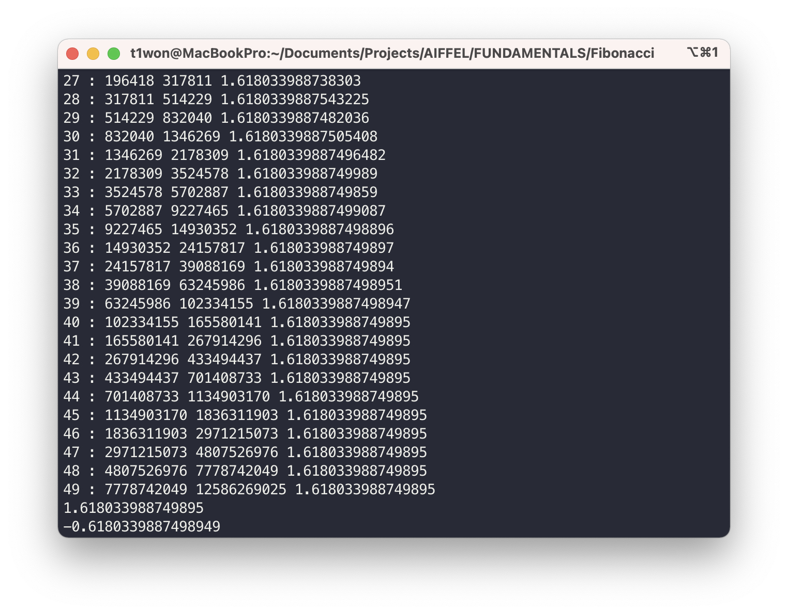
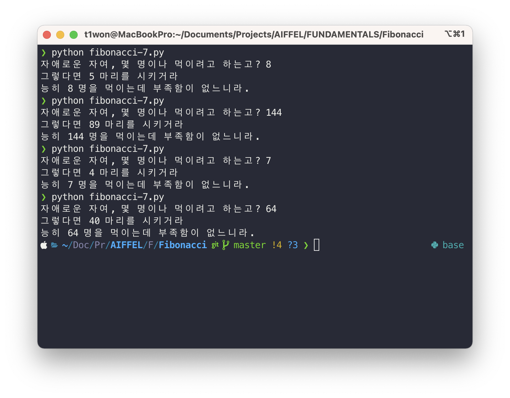

# FUNDAMENTAL 04

## 자료형
- [부동소수점 설명](https://velog.io/@thms200/%EB%B6%80%EB%8F%99%EC%86%8C%EC%88%98%EC%A0%90-0.1-0.1-02-jbk5jrde3a)

## 피보나 치킨 수
$F(N)$명의 사람이 먹을 적당한 치킨 수는 $F(N-1)$ 마리이다.

### 제켄도르프의 정리: Zeckendorf's Theorem
모든 자연수는 연속하지 않는 피보나치 수의 합으로 유일하게 표현할 수 있다.

### Fibona-Chicken Algorithm
- 입력: 임의의 자연수 $N$
- 출력: $N$명이 먹기에 적당한 치킨의 수 $C$ 
- 알고리즘:
	- 만약 $N$이 $i$번째 피보나치수이면, 즉, $N=F(i)$이면 $C=F(i-1)$을 리턴
	- 만약 $N$이 피보나치 수가 아니면,
    	- 제켄도르프 분해를 한다: $N = F(i_1) + F(i_2) + ... + F(i_k)$
		- $C = F(i_1 - 1) + F(i_2 - 1) + ... + F(i_k - 1)$을 리턴

#### 피보나치 생성 함수: Binet의 공식
- 임의의 자연수 $i$에 대해서, $N= F(i)$를 직접 계산할 수 있는가?

#### 피보나치 판별식:
- 임의의 자연수 $N$에 대해서, $N$이 피보나치 수임을 판별할 수 있는가?

#### 피보나치 역함수:
- 임의의 자연수 $N=F(i)$에 대하여, $i$를 직접 계산할 수 있는가?

#### 제켄도르프 분해:
- 임의의 피보나치 수 $N=F(i)$에 대하여, 제켄도르프 분해를 할 수 있는가?

### 황금비: Golden Ration
세상에서 가장 아름다운 비율: $1: 1.618$

### 피보나치 수와 황금비의 관계
피보나치 수열에서 $F(i)$와 $F(i+1)$의 비율은 황금비에 수렴한다.

```python
def FibonacciSequence(n):
    F = [0, 1]  # Fibonacci Sequence list
    for i in range(2, n + 1):
        F.append(F[i - 1] + F[i - 2])
    return F


n = 50
F = FibonacciSequence(n)
for i in range(1, len(F) - 1):
    print(i, ":", F[i], F[i + 1], F[i + 1] / F[i])

# 황금비 출력
from math import sqrt

phi = (1 + sqrt(5)) / 2
phi_ = 1 - phi

print(phi)
print(phi_)

```

인덱스가 커질 수록 $F(i)$와 $F(i+1)$의 비율이 황금비에 수렴하는 것을 알 수 있다.

### 비네의 공식: Binet's Formula
1842년, 프랑스의 수학자 Binet가 발견한 피보나치 수의 생성 함수
```python
from math import sqrt, floor

phi = (1 + sqrt(5)) / 2
phi_ = 1 - phi


def Binet(i):
    return round((phi ** i - phi_ ** i) / sqrt(5))


n = 50
for i in range(n + 1):
    print(i, Binet(i))

```
위 코드는 비네의 공식을 파이썬 코드로 구현을 한 것이다.


이번에는 이전에 만든 피보나치 수열 함수로 만든 수열과 비네의 공식을 이용해서 만든 피보나치 수열을 비교해본다.
```python
n = 1000
F = FibonacciSequence(n)
for i in range(n + 1):
    if F[i] != Binet(i):
        print("Oops!", i, F[i], Binet(i))
        break

```
```
Oops! 71 308061521170129 308061521170130
```
인덱스 71번째에 값이 달라진다. 컴퓨터의 floating point 표현의 한계 때문에 생기는 일이다.

### 피보나치 수의 판별식
Binet의 공식을 응용하면 다음을 증명할 수 있다.
- 자연수 $N$이 피보나치 수일 필요충분조건은 다음과 같다.
- $5N^2 + 4$, 또는 $5N^2 - 4$가 완전제곱수(perfect square)이다.
```python
from math import sqrt, floor


# 완전 제곱수인지 판별
def is_perfect(n):
    rootn = floor(sqrt(n))
    if rootn * rootn == n:
        return True
    return False


def is_fibonacci(N):
    x, y = 5 * N * N + 4, 5 * N * N - 4
    return is_perfect(x) or is_perfect(y)  # x 혹은 y가 완전제곱수이면 피보나치 수열이다


N = 1000

F = []
for i in range(N + 1):
    if is_fibonacci(i):
        F.append(i)
print(F)

```
```
[0, 1, 2, 3, 5, 8, 13, 21, 34, 55, 89, 144, 233, 377, 610, 987]
```

### 피보나치 수의 역함수
피보나치 수 $F(i)$가 주어졌을 때, $i$의 값을 을려면, Binet의 공식에서 역함수를 취하면 된다.

```python
from math import sqrt, log

phi = (1 + sqrt(5)) / 2


def inverse_fibonacci(N):
    return round(log(sqrt(5) * N) / log(phi))


def FibonacciSequence(n):
    F = [0, 1]
    for i in range(2, n + 1):
        F.append(F[i - 1] + F[i - 2])
    return F


n = 50
F = FibonacciSequence(n)
for i in range(1, len(F)):
    print(i, inverse_fibonacci(F[i]))

```
```
1 2
2 2
3 3
4 4
5 5
6 6
7 7
8 8
9 9

...
```
맨 처음만 제외하고 n이 2이상 일 때는 inverse 함수에 피보나치 수를 대입해주면 인덱스가 그대로 나오는 것을 확인할 수 있다.

### 피보나치킨 수:
$N$이 피보나치 수이면 $O(1)$에 가능하다.
```python
# 사람이 N명이면 N-1번째 피보나치 수를 구해야 한다
def FibonaChicken(N):
    if is_fibonacci(N):
        return Binet(inverse_fibonacci(N) - 1) # i - 1을 비네 공식 이용해서 구한다


N = int(input("자애로운 자여, 몇 명이나 먹이려고 하는고? "))
C = FibonaChicken(N)
print("그렇다면", C, "마리를 시키거라")
print("능히", N, "명을 먹이는데 부족함이 없느니라.")

```
`inverse_fibonacci(N)`을 구하면 `i+1`이 된다.
$F(i)$이면 피보나 치킨 수는 $C = F(i - 1)$이다.


N이 피보나치 수가 아니면 제켄도르프 분해로 $O(k / 2) = O(k)$에 가능하다.
```python
def FibonaChicken(N):
    if N <= 2:
        return 1
    i = inverse_fibonacci(N)
	while N > Binet(i):
		i += 1
	return Binet(i - 2) + FibonaChicken(N - Binet(i - 1))

```

### 피보나치 수: The Final Solution
```python
# final solution
from math import sqrt, log, floor

phi = (1 + sqrt(5)) / 2
phi_ = 1 - phi


def Binet(i):
    """
    비네의 공식으로 피보나치 수를 구해준다
    """
    return round((phi ** i - phi_ ** i) / sqrt(5))


def inverse_fibonacci(N):
    """
    피보나치 수열의 역함수:
    
    피보나치 수를 넣어주면 인덱스가 나온다
    """
    return round(log(sqrt(5) * N) / log(phi))


def is_perfect(n):
    """
    완전 제곱수인지 판단

    피보나치 수인지 판단할 때 사용된다.
    """
    rootn = floor(sqrt(n))
    return True if rootn * rootn == n else False


def is_fibonacci(N):
    """
    N이 피보나치 수인지 판단
    """
    x, y = 5 * N * N + 4, 5 * N * N - 4
    return is_perfect(x) or is_perfect(y)


def FibonaChicken(N):
    """
    피보나 치킨 함수
    
    N: 사람 수
    리턴 값 : 치킨 수
    """
    if N <= 2:  # N이 1과 2라면 리턴 1
        return 1
    i = inverse_fibonacci(N)
    if is_fibonacci(N):  # 사람 수가 피보나치 수라면 사람 수 - 1의 피보나치 값을 반환해준다
        return Binet(i - 1)
    else:  # 사람 수가 피보나치수가 아니라면
        while N > Binet(i):  # N보다 큰 첫 번째 피보나치 수의 i 확인
            i += 1
        return Binet(i - 2) + FibonaChicken(
            N - Binet(i - 1)
        )  # i - 2번째 [피보나치 수] + 재귀 호출로 i - 1번째 [피보나 치킨 수] 호출


N = int(input("자애로운 자여, 몇 명이나 먹이려고 하는고? "))
C = FibonaChicken(N)
print("그렇다면", C, "마리를 시키거라")
print("능히", N, "명을 먹이는데 부족함이 없느니라.")

```


### 피보나치킨 알고리즘의 복잡도 분석
- N이 피보나치 수일 때 $O(1)$에 가능
- N이 피보나치 수가 아니면 $O(k)$에 가능
    - 여기서 $k$는 $F(N)$보다 작거나 같은 피보나치 수열의 길이

### 참고 자료
- [피보나 치킨](https://fibonachicken.herokuapp.com/#)
- [피보나치 수와 황금비: 쓸데없이 고퀄인 피보나치킨 알고리즘 TMI 연구](https://www.youtube.com/watch?v=RgjLmjDQQww&ab_channel=%EC%A3%BC%EB%8B%88%EC%98%A8TV%EC%95%84%EB%AC%B4%EA%B1%B0%EB%82%98%EC%97%B0%EA%B5%AC%EC%86%8C)

## 피보나치 - 메모이제이션
```python
memory = {1: 1, 2: 1}

def fibonacci(n):
    if n in memory:
        number = memory[n]
    else:
       number = fibonacci(n-1) + fibonacci(n-2)
       memory[n] = number
    return number

print(fibonacci(100))

print(memory)
```