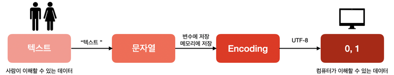

# FUNDAMENTAL 05

## 문자열 다루기
### 인코딩과 디코딩
- 인코딩(encoding): 문자열을 바이트로 변환하는 과정
- 디코딩(decoding): 바이트를 문자열로 변환하는 과정
#### 텍스트 데이터의 처리 과정



국제표준기구인 ISO(International Standars Organization)은 전세계 문자를 모두 표시할 수 있는 표준코드를 제정하였는데 이것이 바로 유니코드(Unicode)이다.


UTF-8과 유니코드를 혼동하는 경우가 많은데 이는 유니코드의 버전이 많아서 생기는 오해이다. 유니코드는 오직 한 가지 버전만 존재한다.


UTF-8, UTF-16등은 유니코드로 정의된 텍스트를 메모리에 인코딩하는 방식들을 말한다.

#### 파이썬 내장함수 `ord()`와 `chr()`
- `ord()` : 해당 문자에 대응하는 유니코드 숫자를 반환한다.
- `chr()` : 해당 유니코드 숫자에 대응하는 문자를 반환합니다.
```python
print(ord('a'))    
print(ord('A'))
print(chr(97))
print(ord('가'))
print(chr(0xAC00)) # 44032의 16진수 표현
```
```
97
65
a
44032
가
```
#### 파이썬에서 모든 무낮열은 유니코드로 표현된다
파이썬 3부터 문자열은 내부적으로 유니코드 규약에 따른다.

외부 데이터 및 데이터베이스로부터 데이터를 읽거나 보낼 떄는 `인코딩` 혹은 `디코딩` 작버을 거쳐야 하며,
인코딩 규약은 내부적으로 `유니코드(UTF-8)`임을 의미한다.

> 파이썬 3부터는 문자열이 무조건 유니코드로 인코딩되므로 해당 텍스트가 인코딩이 되어 있는지 혹은 디코딩이 되어 있는지만 고려하면 된다.

```python
#- 파이썬 3-#
#- bytes와 string으로 구분됩니다.

str1 = b'hello'
str2 = 'hello'
str3 = u'hello'
print(type(str1), type(str2), type(str3))
```
```
<class 'bytes'> <class 'str'> <class 'str'>
```


#### 참고 자료
- [유니코드 테이블](https://ko.wikipedia.org/wiki/%EC%9C%A0%EB%8B%88%EC%BD%94%EB%93%9C_%EC%98%81%EC%97%AD)
- [유니코드와 UTF-8](https://jeongdowon.medium.com/unicode%EC%99%80-utf-8-%EA%B0%84%EB%8B%A8%ED%9E%88-%EC%9D%B4%ED%95%B4%ED%95%98%EA%B8%B0-b6aa3f7edf96)
- [UTF-8과 UTF-16](https://pickykang.tistory.com/13)
- [유니코드(UTF-8) 한글 코드표, 한글코드 범위 {AC00-D7AF}](https://jjeong.tistory.com/696)

### 문자열 다루기

#### 원시 문자열
문자열을 시작하는 따옴표 앞에 `r`을 붙이면 이스케이프 문자가 적용되지 않는 있는 그대로의 
`원시 문자열(raw string)`을 나타낼 수 있다.
```python
print('Please don\'t touch it')
print(r'Please don\'t touch it')
```
```
Please don't touch it
Please don\'t touch it
```

#### startswith, endswith
##### startswith
```python
EmployeeID = [
    "OB94382",
    "OW34723",
    "OB32308",
    "OB83461",
    "OB74830",
    "OW37402",
    "OW11235",
    "OB82345",
]

# OB로 시작하는 ID만 따로 저장
Production_Employee = [P for P in EmployeeID if P.startswith("OB")]
print(Production_Employee)

```

```
['OB94382', 'OB32308', 'OB83461', 'OB74830', 'OB82345']
```
##### endswith

```python
import os

# 파일 이름을 리스트 형태로 저장
photo = os.listdir("/Users/t1won/Documents/blog thumbnail")

# png로 끝나는 파일들만 png 리스트에 저장
png = [png for png in photo if png.endswith(".png")]

print(photo)
```

#### 공백 문자 제거하기

##### 여러가지 공백 문자
- 스페이스(space) : 한 칸 띄어쓰기
- 탭(tab) `\t`
- 줄 바꿈(new line)
- 라인 피드 (line feed) `\n` : 줄 바꿈을 엄밀히 말하면 라인 피드라 한다.
- 개행 복귀 (carriage return) `\r` : 커서를 맨 앞으로 이동시키는 것, 즉 커서를 원위치로 복귀(return)한다는 뜻

파이썬에서는 `strip()` 메서드를 사용해 공백 문자를 처리한다.
```python
txt = "      Strip white spaces.      "
print('[{}]'.format(txt))
print('--------------------------')

#- 양쪽 공백 제거 : strip()
print('[{}]'.format(txt.strip()))
print('--------------------------')

#- 왼쪽 공백 제거 : lstrip()
print('[{}]'.format(txt.lstrip()))
print('--------------------------')

#- 오른쪽 공백 제거 : rstrip()
print('[{}]'.format(txt.rstrip()))
```
```
[      Strip white spaces.      ]
--------------------------
[Strip white spaces.]
--------------------------
[Strip white spaces.      ]
--------------------------
[      Strip white spaces.]
```

#### 대소문자 관련
- `upper()` : 모든 문자를 대문자로 변환합니다.
- `lower()` : 모든 문자를 소문자로 변환합니다.
- `capitalize()` : 첫 글자만 대문자로 변환합니다.

#### isX
문자열의 구성에 따라 불린(boolean)의 값을 반환(return) 해준다.

- `isupper()` : 문자열이 모두 **대문자로**만 되어 있으면 True, 그렇지 않으면 False를 반환
- `islower()` : 문자열이 모두 **소문자로**만 되어 있으면 True, 그렇지 않으면 False를 반환
- `istitle()` : 문자열의 **첫 글자만 대문자**로 되어 있으면 True, 그렇지 않으면 False를 반환
- `isalpha()` : 문자열이 모두 **알파벳 문자로**만 되어 있으면 True, 그렇지 않으면 False를 반환
- `isalnum()` : 문자열이 모두 **알파벳 문자와 숫자로**만 되어 있으면 True, 그렇지 않으면 False를 반환
- `isdecimal()` : 문자열이 모두 **숫자로**만 되어 있으면 True, 그렇지 않으면 False를 반환

#### join()과 split()
##### join
`join()`은 각각의 원소를 모아 하나의 문자열로 합쳐준다.
```python
stages = ['fundamentals', 'exploration', 'goingdeeper']
", ".join(stages)
```
```
'fundamentals, exploration, goingdeeper'
```

##### split
`split()`은 반대로 하나의 문자열을 구분자를 기준으로 나누어 준다.
```python
'fundamentals, exploration, goingdeeper'.split(', ')
```
```
'fundamentals, exploration, goingdeeper'.split(', ')
```

#### replace()
`replace()` : `replace(s1, s2)` 형태로 문자열 내 문자열 `s1`을 `s2`로 바꾼다
```python
sent = 'We love C++'
sent.replace('C++', 'Python')
```
```
'We love Python'
```

#### 불변(immutable)의 문자열
- `가변객체(mutable object)` : 객체를 생성한 후 객체의 값을 수정할 수 있다. 변수는 값이 수정된 같은 객체를 가리키게 된다.
    - `list`, `set`, `dict`

- `불변객체(immutable object)` : 객체를 생성한 후 객체의 값을 수정할 수 없다. 변수는 해당 값을 가진 다른 객체를 가리키게 된다.
    - `int`, `float`, `complex`, `bool`, `string`, `tuple`, `frozen set`

#### 참고 자료
- [Python 개념 정리 - 객체란 ( mutable vs immutable )](https://webnautes.tistory.com/1181)

### 정규 표현식
`정규 표현식(regular expression, regex)`는 대부분의 운영 체제, 다양한 프로그래밍 언어, 그리고 텍스트 편집기와 같은 프로그램들이 지원을 하고 있다.


#### 문자열 vs 정규 표현식
문자열을 바꿀 때 파이썬에서 `replace()` 메소드를 사용할 수 있다.
```python
sent = 'I can do it!'
sent.replace("I", "You")
```

또 다른 방법으로 `정규 표현식`을 사용할 수 있다.
```python
import re

sent = "I can do it"
pattern = re.sub("I", "You", sent)
print(pattern)

```
```
'You can do it!'

```
정규 표현식은 우리가 찾고자 하는 문자열 패턴을 정의하고 기존 문자열과 일치하는지 비교한다.

#### 정규 표현식 시작하기
##### import re
파이썬에서는 표준 라이브러리인 `re` 모듈을 `import`해서 정규 표현식을 사용한다.
```python
import re
```

##### Compile()
> 정규 표현식의 사용법은 크게 두 가지로 나뉜다.
> 1) 찾고자 하는 문자의 패턴 정의한다.
> 2) 정의된 패턴과 매칭되는 경우를 찾아 다양한 처리를 한다

이중 `1)`에 해당하는 과정을 `컴파일(compile)`이라 한다.
```python
import re

pattern = re.compile("the")

print(pattern.findall("of the people, for the people, by the people"))

```
```
['the', 'the', 'the']
```

다음과 같이 한줄로 처리할 수도 있다.
```python
re.findall('the', 'of the people, for the people, by the people')
```

#### 메소드
이전 단계에서 `Compile()`을 이용하여 패턴 객체를 만들었다면 이 객체를 활용해서 호출 가능한 메소드와 속성을 알아본다.

- `search()` : 일치하는 패턴 찾기 (일치 패턴이 있으면 `MatchObject`를 반환합니다)
- `match()` : search()와 비슷하지만, 패턴이 검색대상에 처음부터 일치해야 합니다. (`MatchObject` 반환)
- `findall()` : 일치하는 모든 패턴 찾기 (모든 일치 패턴을 `리스트`에 담아서 반환합니다)
- `split()` : 패턴으로 나누기
- `sub()` : 일치하는 패턴으로 대체하기

아래는 `search()`, `match()` 등이 리턴하는 `MatchObject`가 가진 메소드입니다.

- `group()` : 실제 결과에 해당하는 문자열을 반환합니다.

```python
src = "My name is... My name is"
regex = re.match("My", src) # 패턴 찾으면 MatchObject 리턴한다
print(regex)

if regex: # MatchObject를 찾으면
    print(regex.group()) # 실제 결과에 해당하는 문자열 반환
else:
    print("No!")
```

#### 패턴 : 특수문자, 메타문자
패턴은 정규 표현식으 강력하게 해주는 도구인데 특수 문자 혹은 메타 문자라 불리는 `[]. -. . ? * + {} /`등을 이용해 특수한 패턴을 만들 수 있다.

- `[ ]` : 문자
- `-`: 범위
- `.` : 하나의 문자
- `?` : 0회 또는 1회 반복
- `*` : 0회 이상 반복
- `+` : 1회 이상 반복
- `{m, n}` : m ~ n
- `\d` : 숫자
- `\D` : 비숫자
- `\w` : 알파벳 문자
- `\W` : 비알파벳 문자
- `\s` : 공백 문자
- `\S` : 비공백 문자
- `\b` : 단어 경계
- `\B` : 비 단어 경계


##### 예제 1
```python
#- 연도(숫자)
text = """
The first season of America Premiere League  was played in 1993. 
The second season was played in 1995 in South Africa. 
Last season was played in 2019 and won by Chennai Super Kings (CSK).
CSK won the title in 2000 and 2002 as well.
Mumbai Indians (MI) has also won the title 3 times in 2013, 2015 and 2017.
"""
pattern = re.compile("[1-2]\d\d[5~7]") # 1~2의 숫자 + 숫자 + 숫자 + 5~7의 숫자
pattern.findall(text)
```
```
['1995', '2015', '2017']
```

##### 예제 2
```python
#- 전화번호(숫자, 기호)
phonenumber = re.compile(r'\d\d\d-\d\d\d-\d\d\d\d')
phone = phonenumber.search('This is my phone number 010-111-1111') # search는 패턴을 찾아준다
if phone:
  print(phone.group()) # 결과에 해당하는 문자열 반환
print('-' * 14)
phone = phonenumber.match ('This is my phone number 010-123-1111') # match는 처음부터 일치해야 한다
if phone:
  print(phone.group())
```
```
010-111-1111
--------------
```


##### 예제 3
```python
#- 이메일(알파벳, 숫자, 기호)
text = "My e-mail adress is doingharu@aiffel.com, and tomorrow@aiffel.com"
pattern = re.compile("[0-9a-zA-Z]+@[0-9a-z]+\.[0-9a-z]+")
pattern.findall(text)
```
```
['doingharu@aiffel.com', 'tomorrow@aiffel.com']
```
`+`는 한 개 이상을 의미한다.

#### 구현 순서
- `import re` 를 통해 정규식 모듈을 가져온다.
- `re.compile()` 함수로 Regex 객체를 만든다.
- 검색할 문자열을 Regex 객체의 `search()` , `findall()` 메소드로 전달한다.


## 파일과 디렉토리

### 파일

#### write
```python
f = open("hello.txt","w") 
#- open(파일명, 파일모드)
#- 파일을 열고 파일 객체를 반환합니다. 
for i in range(10):
    f.write("안녕")
    #- write() 메소드로 '안녕'을 10번 씁니다.
f.close()
#- 작업이 끝나면 close() 메소드로 닫아줍니다. *필수!
```

#### read
```python
with open("hello.txt", "r") as f:
  print(f.read())
```
`with` 구문으로 파일을 열면 `with` 문이 종료될 때 자동으로 `close`가 된다.

#### 파일 관련 메소드
- `f.read()` : 파일을 읽는다.
- `f.readline()` : 파일을 한 줄씩 읽는다.
- `f.readlines()` : 파일 안의 모든 줄을 읽어 그 값을 리스트로 반환한다.
- `f.write(str)` : 파일에 쓴다. 문자열 타입을 인자로 받는다.
- `f.writelines(str)` : 파일에 인자를 한 줄씩 쓴다.
- `f.close()` : 파일을 닫는다.
- `f.seek(offset)` : 새 파일의 위치를 찾는다.

### 디렉토리

#### 참고 자료
- [리눅스 강의 10강. Linux(Unix) 파일 시스템 구조](https://www.youtube.com/watch?v=hZ6j_g_O3Ts&ab_channel=%EB%89%B4%EB%A0%89%EC%B2%98)
- [[linux] 리눅스 기본 명령어/자주 쓰는 명령어](https://itholic.github.io/linux-basic-command/)

### 모듈과 패키지

#### 파이썬 파일은 어디에 저장될까?
파이썬에서는 지원하는 디렉토리 관련 표준 라이브러리는 다음과 같다.
- sys
- os
- glob

파이썬 실행 파일(`python.exe`)의 위치 확인
```python
#- 현재 실행되고 있는 파이썬 실행 파일의 디렉토리를 반환합니다.
import sys
sys.executable
```

`import`할 때 불러오는 모듈들의 경로 확인
```python
#- 임포트할 때 불러 오는 모듈들이 위치한 경로입니다.
sys.path
```

#### 파이썬 모듈 및 패키지 개념 정리
##### 개념
- `모듈(module)` : 파이썬으로 만든 코드가 들어간 파일 `.py`
- `패키지(package)` : `__init__.py`가 포함된 폴더로 흔히 라이브러리라고 칭함
- `PIP(Package Installer for Python)` : 패키지 관리자로 파이썬을 설치하면 기본으로 설치됨
- `PyPA(Python Packaging Authority)` : 파이선 패키지를 관리하고 유지하는 그룹
- `PyPI(The Python Package Index)` : 파이썬 패키지들의 저장소

##### 함수
- `sys.path` : 현재 폴더와 파이썬 모듈들이 저장되어 있는 위치를 리스트 형태로 반환
- `sys.path.append()` : 자신이 만든 모듈의 경로를 `append` 함수를 이용해서 추가함으로써 추가한 디렉토리에 있는 파이썬 모듈을 불러와 사용할 수 있다.
- `os.chdir()` : 디렉토리 위치 변경
- `os.getcwd()` : 현재 자신의 디렉터리 위치를 반환
- `os.mkdir()` : 디렉토리 생성
- `os.rmdir()` : 디렉토리 삭제 (단, 디렉토리가 비어 있을 경우)
- `glob.glob()` : 해당 경로 안의 디렉토리나 파일들을 리스트 형태로 반환
- `os.path.join()` : 경로(path)를 병합하여 새 경로 생성
- `os.listdir()` : 디렉토리 안의 파일 및 서브 디렉토리 리스트
- `os.path.exists()` : 파일 혹은 디렉토리의 경로 존재 여부 확인
- `os.path.isfile()` : 파일 경로의 존재 여부 확인
- `os.path.isdir()` : 디렉토리 경로의 존재 여부 확인
- `os.path.getsize()` : 파일의 크기 확인

## 여러가지 포맷 다루기

### CSV 파일

#### CSV
CSV는 Comma Seperated Value의 약자로, 쉼표로 구분된 파일을 말한다.

```python
billboardchart = {
    1: ["Tho Box", "Roddy Ricch", "2019-12-19"],
    2: ["Don't Start Now", "Dua Lipa", "2019-11-01"],
    3: ["Life Is Good", "Future Featuring Drake", "2020-02-10"],
    4: ["Blinding", "The Weeknd", "2019-11-29"],
    5: ["Circles", "Post Malone", "2019-08-30"],
}

# 딕셔너리의 value들을 csv 파일로 저장
with open("billboardchart.csv", "w") as f:
    for i in billboardchart.values():  # 딕셔너리의 value만 불러온다
        data = ",".join(i)  # ,로 분리
        f.write(data + "\n")  # 개행

```

기존 CSV 파일 읽어 온 후 헤더 부분을 추가 하여 다른 이름으로 저장하기
```python
import csv

header = ["title", "singer", "released date"]

with open("billboardchart.csv", "r") as inputfile:
    with open("billboardchart_out.csv", "w", newline="\n") as outputfile:
        fi = csv.reader(
            inputfile, delimiter=","
        )  # 지정된 csvfile의 줄을 이터레이트 하는 판독기(reader) 객체를 반환

        fo = csv.writer(
            outputfile, delimiter=","
        )  # 지정된 파일류 객체에 분리된 문자열로 사용자의 데이터를 변환하는 기록기(writer) 객체를 반환

        fo.writerow(header)  # 헤더 파일 작성

        for row in fi:
            fo.writerow(row)

```
##### 참고 자료
- [CSV 모듈](https://docs.python.org/ko/3/library/csv.html)
- [What does the `newline=” “` argument do?](https://discuss.codecademy.com/t/what-does-the-newline-argument-do/463575)


#### CSV 파일과 Pandas
`판다스(pandas)`의 `DataFrame`은 `to_csv` 메소드를 지원한다.
이 메소드를 이용하면 csv 파일로 쉽게 저장할 수 있다.

데이터 준비
```python
#- 1. 데이터를 준비합니다.
fields = ["title", "singer", "released date"]
rows = [ ["Tho Box","Roddy Ricch","2019-12-19"],
               ["Don't Start Now", "Dua Lipa", "2019-11-01"],
               ["Life Is Good", "Future Featuring Drake", "2020-02-10"],
               ["Blinding", "The Weeknd", "2019-11-29"],
               ["Circles", "Post Malone","2019-08-30"]]
```

판다스를 이용해 데이터를 csv 파일로 저장
```python
# - 2. 판다스를 이용해 데이터를 csv 파일로 저장합니다.
import pandas as pd

df = pd.DataFrame(rows, columns=fields)
df.to_csv("pandas.csv", index=False)

```

```python
# CSV 파일 읽어서 DataFrame으로 저장
df = pd.read_csv("pandas.csv")
print(df.head())

```
```
             title                  singer released date
0          Tho Box             Roddy Ricch    2019-12-19
1  Don't Start Now                Dua Lipa    2019-11-01
2     Life Is Good  Future Featuring Drake    2020-02-10
3         Blinding              The Weeknd    2019-11-29
4          Circles             Post Malone    2019-08-30
```

똑같은 과정을 파이썬의 `csv` 모듈로 하면 다음과 같다.
```python
# - 3. 동일한 내용을 csv.writer를 이용해 수행해 봅니다.
import csv

filename = "test.csv"
with open(filename, "w+", newline="\n") as csv_file:
    csv_writer = csv.writer(csv_file)
    csv_writer.writerow(fields)
    csv_writer.writerows(rows)

```

### XML 파일
#### XML
XML은 Extensible Markup Language의 약자로, 다목적 마크업 언어이다.
```xml
<Person>
    <Name>이펠</Name>
    <Age>28</Age>
    <Place>강남</Place>
</Person>
```
마크업 언어는 위와 같이 태그라 불리는 꺽쇠 모영의 괄호(`<>`)로 구분된 언어이다.

1. XML은 다목적 마크업 언어(Extensible Markup Language)이다.
2. 마크업 언어는 태그(tag)로 이루어진 언어를 말하며, 상위(부모)태그 - 하위(자식)태그의 계층적 구조를 가지고 있다.
3. XML은 요소(element)들로 이루어져 있다.
4. 요소는 `<열린태그> 내용 </닫힌태그>`가 기본적인 구조이며, 속성(attribute)값을 가질 수도 있다.


#### XML 파일 만들기
##### ElementTree
파이썬 표준 라이브러리인 ElementTree는 XML 관련 기능을 다음과 같이 제공한다.
- `Element()` : 태그 생성
- `SubElement()` : 자식 태그 생성
- `tag` : 태그 이름
- `text` : 텍스트 내용 생성
- `attrib` : 속성 생성

##### dump()
생성된 XML 요소 구조를 시스템(`sys.stdout`)에 사용한다.
- `write()` : XML 파일로 저장
- 리스트(list)와 유사한 메소드를 제공
   - append, insert, remove, pop

```python
import xml.etree.ElementTree as ET

person = ET.Element("Person")

name = ET.Element("name")
name.text = "Thomas Shelby"
person.append(name)  # name 태그를 person 태그에 append

age = ET.Element("age")
age.text = "34"
person.append(age)  # age 태그를 person 태그에 append

ET.SubElement(person, "place").text = "Birmingham"  # 자식 태그 생성

person.attrib["id"] = "0x0001"  # person의 attribute 변경
name.tag = "fullName"  # name의 태그명 변경

# 새로운 태그 생성
gang = ET.Element("gangName", loc="England")
gang.text = "Peaky Blinders"

# name 태그 다음 위치에 삽입
person.insert(1, gang)

# 태그 삭제
person.remove(age)


ET.dump(person)  # sys.stdout
ET.ElementTree(person).write("person.xml")  # 파일로 저장


```
```xml
<Person id="0x0001">
<fullName>Thomas Shelby</fullName>
<gangName loc="England">Peaky Blinders</gangName>
<place>Birmingham</place>
</Person>
```
#### XML 파싱하기

##### 필수 패키지 설치
```
pip install beautifulsoup4
```


##### 필요한 라이브러리 설치 확인
```
pip list | grep beautifulsoup4
pip list | grep lxml
```

```python
from bs4 import BeautifulSoup

with open("books.xml", "r", encoding="utf8") as f:
    booksxml = f.read()  # - 파일을 문자열로 읽기


# - BeautifulSoup 객체 생성 : lxml parser를 이용해 데이터 분석
soup = BeautifulSoup(booksxml, "lxml")

for title in soup.find_all("title"):
    print(title.get_text())  # -  태그를 찾는 find_all 함수 이용


```
```
XML Developer's Guide
Midnight Rain
Maeve Ascendant
Oberon's Legacy
The Sundered Grail
Lover Birds
Splish Splash
Creepy Crawlies
Paradox Lost
Microsoft .NET: The Programming Bible
MSXML3: A Comprehensive Guide
Visual Studio 7: A Comprehensive Guide
```


#### 참고 자료
- [세계보건기구(WHO)에서 제공하는 데이터 API 정보](https://apps.who.int/gho/athena/api/GHO)
- [xml.etree.ElementTree — ElementTree XML API](https://docs.python.org/ko/3/library/xml.etree.elementtree.html)
- [books 예제 파일](https://docs.microsoft.com/en-us/previous-versions/windows/desktop/ms762271(v%3Dvs.85))
- [bs4 methods](https://www.crummy.com/software/BeautifulSoup/bs4/doc/#parsing-xml)

### JSON 파일
JSON은 JavaScript Object Notation의 약자로, 웹 언어인 JavaScript의 데이터 객체 표현 방식이다.


웹 브라우저와 다른 애플리케이션 사이에서 HTTP 요청으로 데이터를 보낼 때 널리 사용하는 표준 파일 포맷중 하나로, XML과 더불어 웹 API나 config 데이터를 전송할 때 많이 쓰인다.

JSON 파일 예시
```json
person = {
      "first name" : "Yuna",
      "last name" : "Jung",
      "age" : 33,
      "nationality" : "South Korea",
      "education" : [{"degree":"B.S degree", "university":"Daehan university", "major": "mechanical engineering", "graduated year":2010}]
       } 
```
파이썬의 딕셔너리 타입과 매우 유사한 구조를 가지고 있어 파이썬으로 자바스크립트로 작성된 프로그램을 쉽게 다룰 수 있다.

#### JSON 파싱

```python
import json

person = {
    "first name": "Yuna",
    "last name": "Jung",
    "age": 33,
    "nationality": "South Korea",
    "education": [
        {
            "degree": "B.S degree",
            "university": "Daehan university",
            "major": "mechanical engineering",
            "graduated year": 2010,
        }
    ],
}

# json 파일로 저장하기
with open("person.json", "w") as f:
    json.dump(person, f)

# json 파일의 내용을 파이썬 dict 객체로 읽어오기
# encoding => utf-8
with open("person.json", "r", encoding="utf-8") as f:
    contents = json.load(f)  # json load
    print(contents["first name"])
    print(contents["education"])

```
```
Yuna
[{'degree': 'B.S degree', 'university': 'Daehan university', 'major': 'mechanical engineering', 'graduated year': 2010}]
```

#### 참고 자료
- [트위터 개발자용 사이트](https://developer.twitter.com/en)